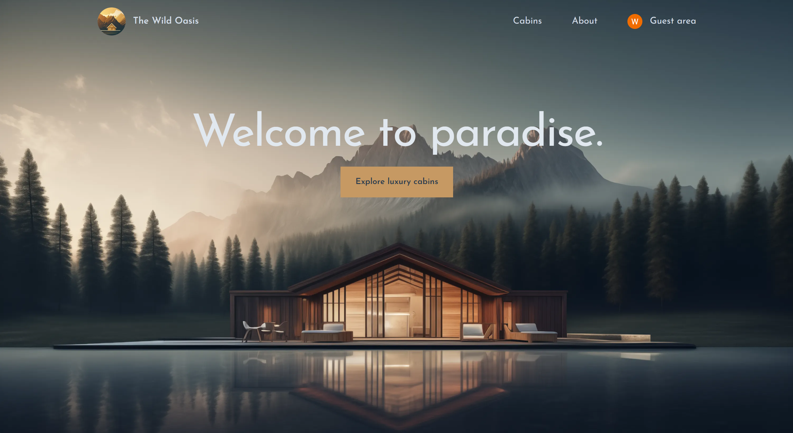
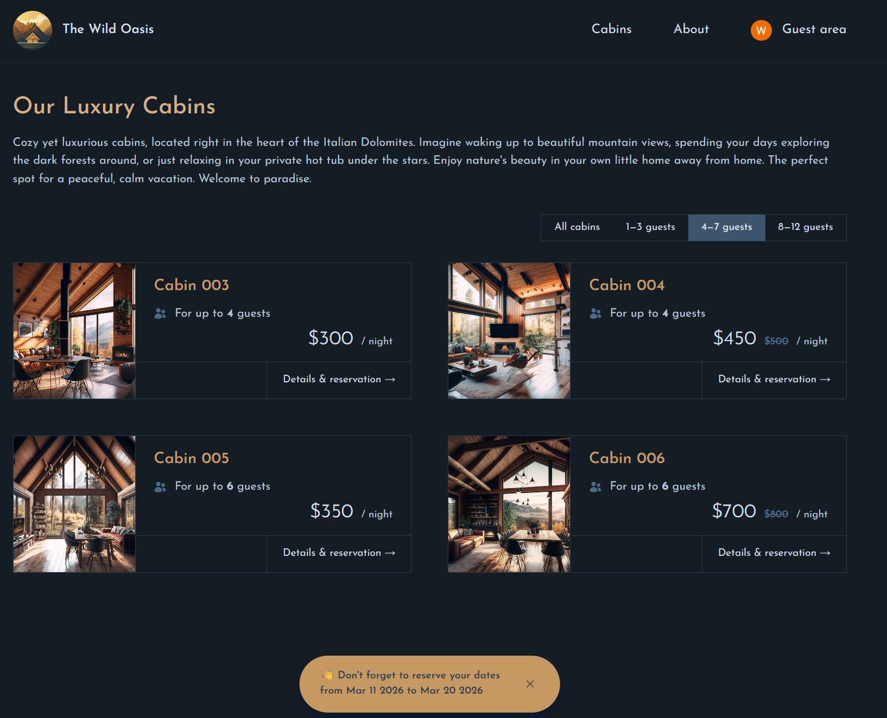
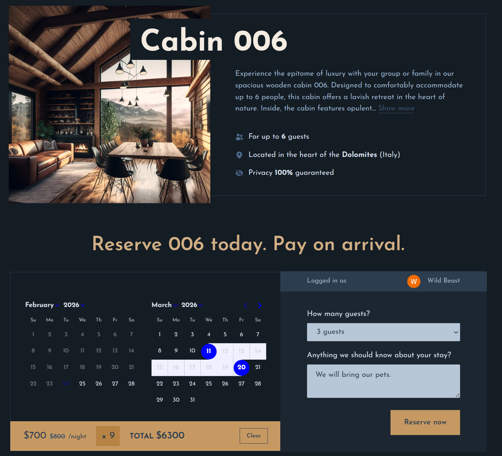
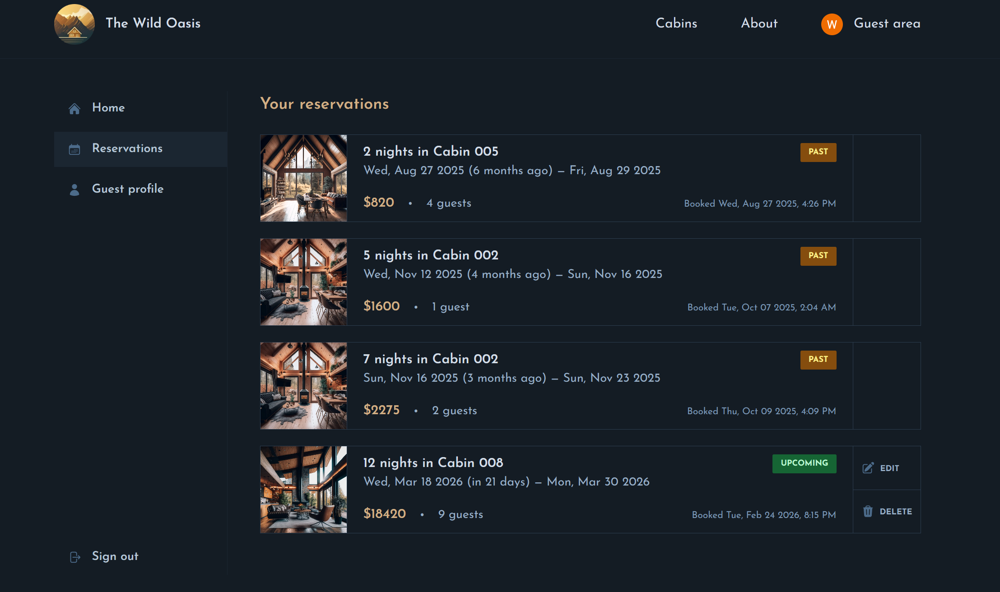
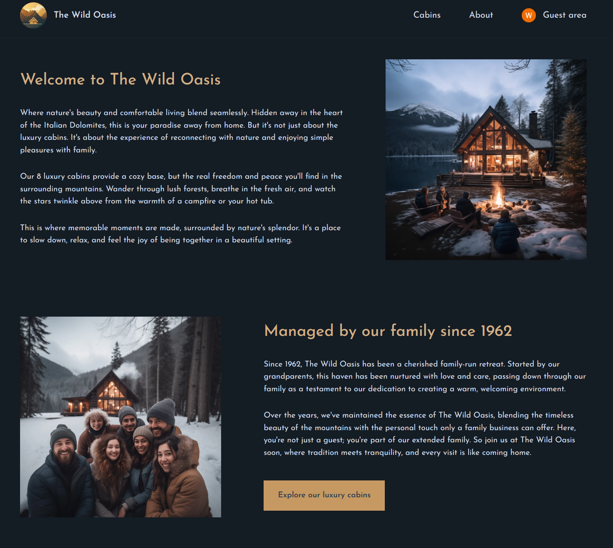

<div align="center">

  

  <h1>The Wild Oasis - Booking</h1>

  <h3>
    <a href="https://the-wild-oasis-beta-neon.vercel.app/">
      <strong>Live Site</strong>
    </a>
  </h3>

  <div align="center">
    <a href="https://the-wild-oasis-beta-neon.vercel.app/">View website</a>
    •
    <a href="https://github.com/Siraj-Adil/the-wild-oasis/issues">Report Bug</a>
    •
    <a href="https://github.com/Siraj-Adil/the-wild-oasis/pulls">Request Feature</a>
  </div>

  <hr>

</div>

<!-- Badges -->
<div align="center">


[](https://www.linkedin.com/in/siraj-adil-3b4022196/)

</div>

<!-- Brief -->


**The-Wild-Oasis** is the **consumer-facing application** of a **two-part hotel booking platform**.  This web app allows customers to browse cabins based on availability, view details, book stays, manage their reservations and update their profiles. It complements the <a href="https://github.com/Siraj-Adil/wild-oasis">admin-facing app</a> used by hotel staff.

---



</a>

## Live Site

Check out the live admin app here: [The Wild Oasis - Admin](https://the-wild-oasis-beta-neon.vercel.app/)

## Customer Version

I also built a **admin version** of this app for hotel employees to manage cabins, bookings, and guests. The repository is [here](https://github.com/Siraj-Adil/wild-oasis), and the live site is [here](https://wild-oasis-admin-iota.vercel.app/).

## 🚀 Key Features

- View all available cabins with descriptions and images.
- Book a cabin based on available dates and select the number of guests.
- Sign in with Google to manage bookings.
- View your booked cabins, edit them, or cancel if needed.
- Update your profile information.
- Fully responsive on all devices (I made sure to make it mobile-friendly!).

## 👨‍💻 Technologies Used

- **Next.js 14** for server-side rendering and routing  
- **React 18** with functional components and hooks  
- **TailwindCSS 3** for styling and responsive design  
- **Supabase** for authentication, database, and backend integration  
- **NextAuth.js** for secure authentication  
- **React Day Picker** for date selection in booking forms  
- **Heroicons** for icons and UI elements  

---

## ⚡ Setup Instructions

Follow these steps to run the project locally:

### 1. Clone the repository
```bash
git clone https://github.com/Siraj-Adil/the-wild-oasis.git
cd the-wild-oasis
```

### 2. Install dependencies:
```bash
npm install
```

### 3. Set up environment variables:
- Configure Supabase and add the necessary environment variables in a `.env.local` file. Check out the `env_example.txt` for reference.

### 4. Run the development server:
```bash
npm run dev
```

Then open [http://localhost:5173](http://localhost:5173) to view it.

## 🖼 Screenshots

### Browse Cabins Page


### Booking Page


### Manage Bookings Page


### About Page



Created by **Siraj Adil**

## Acknowledgments

This app was developed as part of the [Udemy course](https://www.udemy.com/course/the-ultimate-react-course) by **Jonas Schmedtmann**. Special thanks to Jonas for his excellent teaching and guidance throughout the course.